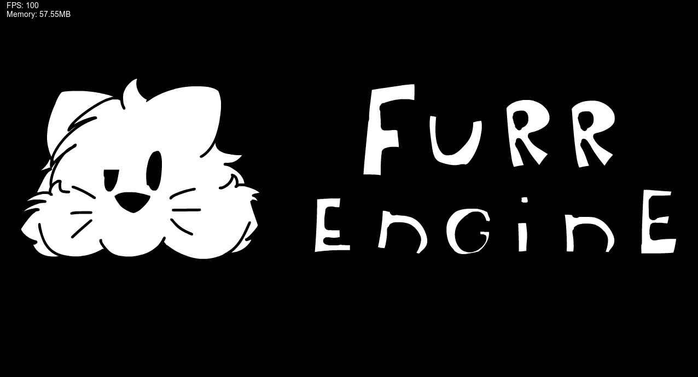
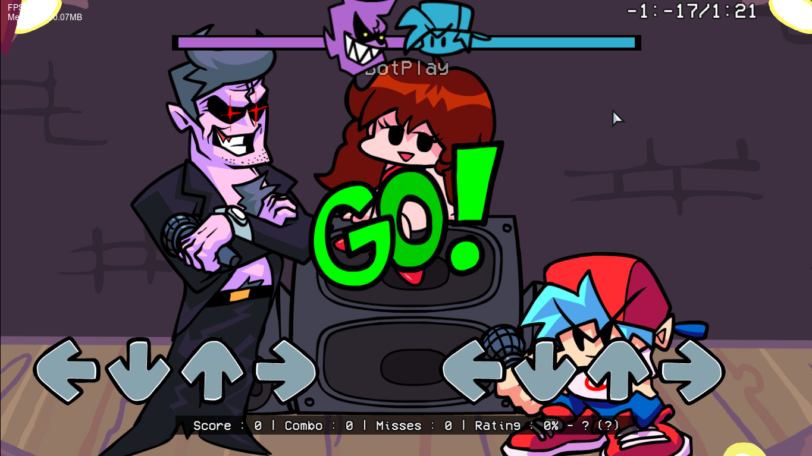
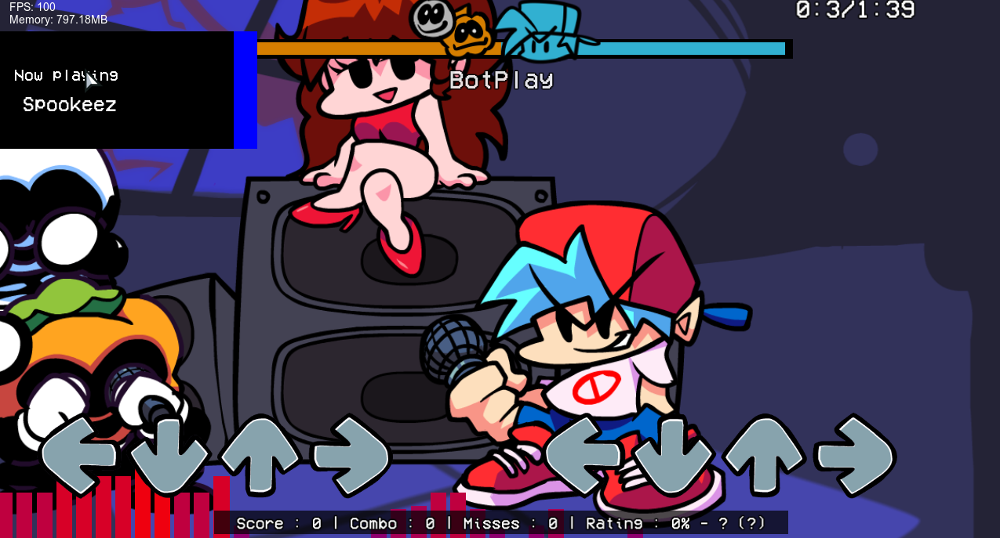
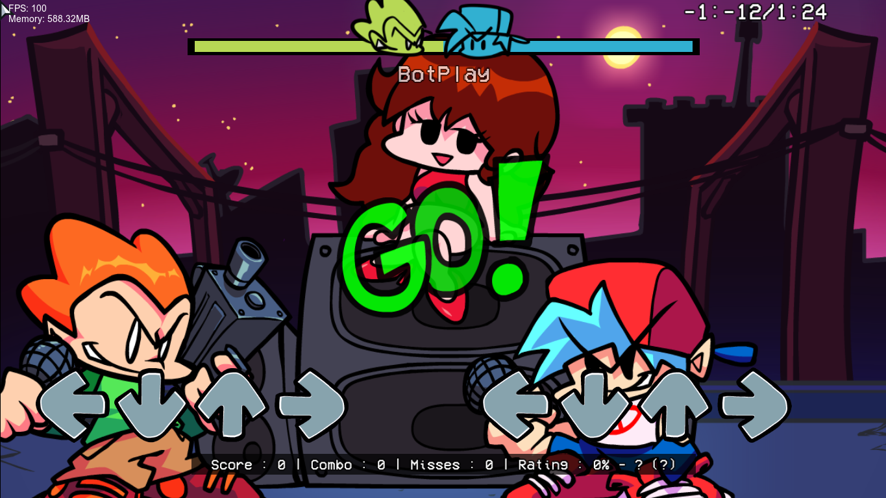
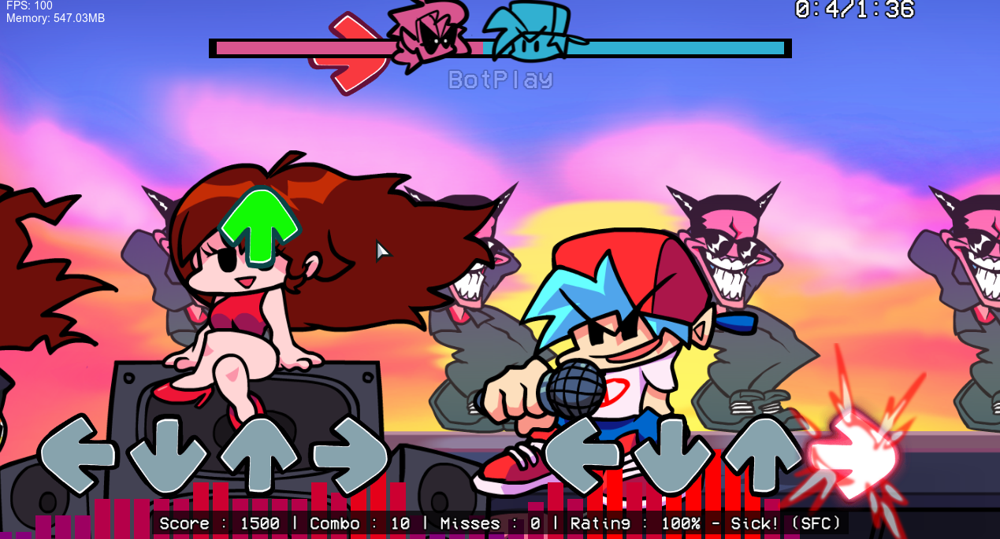

The engine that will be used in the future mod [Friday Night CHUNK' Fluffy Tuesdayin](https://gamebanana.com/mods/543166)

## Credits:

* Lycur - programmer, artist, animator of this project

***

A new engine that was developed by one person, and is designed for more optimized use of resources (Well, at least I planned it that way :' ) )

This is a prototype, so a lot of things are not there yet and do not work as originally planned, or are stubs

***

According to the standard, the main content of FNF is ported here

## now available

# Week 1

* Not fully ported from Psych Engine

# Week 2

* Not fully ported from Psych Engine

# Week 3

* Not fully ported from Psych Engine

# Week 4

* Not fully ported from Psych Engine

***

#The engine can already:

* Load week levels from json files

* Load backgrounds from json files

* Load characters from json files

* You can already make some scripts on haxe (I plan to add support for Lua and python scripts)

***

## In the future

In the future I plan to add standard modding tools,
such as a chart editor, character editor and the like,
as well as my own, such as a mod chart, and a converter of Osu!Mania maps to the FNF mod